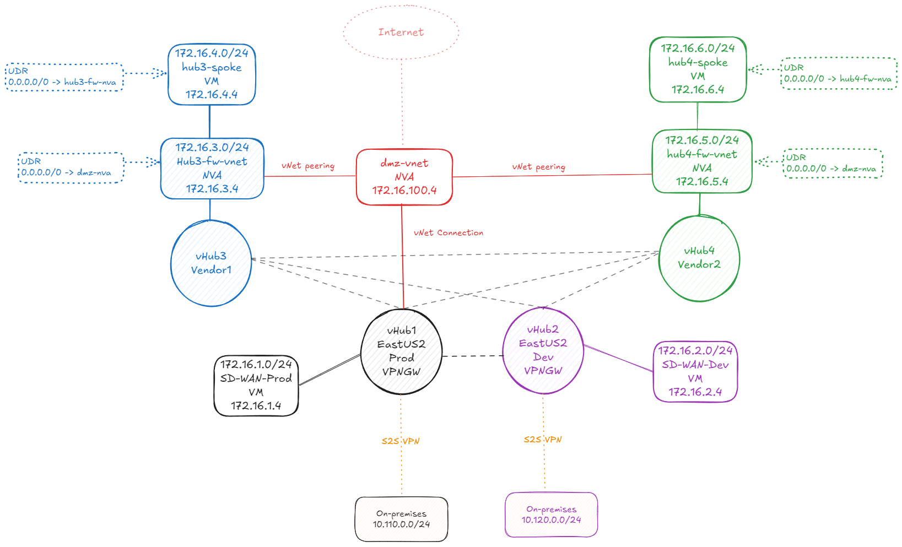

# LAB: Virtual WAN deployment using network isolation (VRF) with labels

This lab provides a step-by-step guide to deploying a Virtual WAN with labels, enabling traffic segregation between third-party vendors and production or development environments. By following this lab, you will learn how to configure and validate network isolation effectively.

### Prerequisites

- Basic knowledge of Azure networking concepts, including Virtual WAN, Virtual Hubs, route tables, and labels.
    - Here are some resources to get you started:
      - [Azure Virtual WAN Overview](https://learn.microsoft.com/en-us/azure/virtual-wan/virtual-wan-about)
      - [About virtual Hub routing](https://learn.microsoft.com/en-us/azure/virtual-wan/about-virtual-hub-routing)

### Network topology



The topology consists of the following components of four environments:
- **Hub1**: Production environment.
- **Hub2**: Development environment.
- **SD-WAN**: Two SD-WAN vNets (one for production another for development) connected to the Virtual WAN via vNET connections. Note that the SD-WAN devices are not part of the lab and are not configured in this deployment. They are only used to illustrate the topology.
- **Hub3**: vHub dedicated to the Vendor1 environment.
- **Hub4**: vHub dedicated to the Vendor2 environment.
- **Fw-vnet**: A fw-vnet is connected to Hub3 (Vendor1) and another connected to Hub4 (Vendor 2). The goal of the fw-vnet is have an Firewall with the goal of perform east/west traffic inspection. The firewall is not part of the lab and is not configured in this deployment. For the lab we use a Linux VM with routing enabled to simulate the firewall. You can replace it with an Azure Firewall or any other firewall solution of your choice.
- **spoke**: Two spoke vNets connected to the Fw-vnet for each vendor. That vNnet hosts the workloads for each vendor. - **On-premises**: Two branches connected to the Virtual WAN via site-to-site VPN connections. One represents the production environment, and the other represents the development environment.
- **DMZ**: A DMZ vNet connected to the production environment but peered with each vendor hub to allow Internet access. NVA present in the fw-vnet has the default route set to the DMZ NVA. For the lab we use a Linux VM with routing enabled to simulate the firewall at the DMZ vnet. You can replace it with an Azure Firewall or any other firewall solution of your choice.

### Important Notes

- The lab is designed to be run in a single Azure region (East US) for simplicity. However, you can modify the deployment script to use different regions if needed.
- The lab uses Azure CLI commands to deploy resources. Ensure you have the Azure CLI installed and configured on your machine or use the Azure Cloud Shell.
- The inspection is done outside of the Virtual WAN hubs. That is necessary because turning Virtual WAN Hub as secured remove the ability to use labels. Therefore, the inspection is done in each vendor fw-vnet.


### Lab Steps

1. Deploy base lab resources using the following command using Azure Cloud Shell or Azure CLI.

```bash
curl -s https://raw.githubusercontent.com/dmauser/azure-vwan-vrf/refs/heads/main/1deploy.sh | bash
```

Alternatively, you can download the script and run it locally which is going to allow you to customize the parameters.

```bash
wget -O deploy.sh https://raw.githubusercontent.com/dmauser/azure-vwan-vrf/refs/heads/main/1deploy.sh 
chmod +xr deploy.sh
./deploy.sh
```

2. Validation before enabling labels (any to any connectivity).

At this point, you have deployed the Virtual WAN with all the components. The next step is to validate the deployment before applying labels for network isolation. The expectation is that all VMs can communicate with each other.

 - 2.1 Validate connectivity between all VMs.
 - 2.2 Review the effective routes for few VMs.

3. Configure labels to segregate traffic between production and development environments as well as between vendor 1 and vendor 2.

```bash
curl -s https://raw.githubusercontent.com/dmauser/azure-vwan-vrf/refs/heads/main/2labelconfig.sh | bash
```

The network isolation (vrf) goal for this lab is to have separation between prod and dev, vendor1 and vendor2. However, vendor1 and vendor2 can access both prod and dev environments.

After you ran the script above, we will have the following labels on each Virtual Hub:
- **prod**: Production environment
- **dev**: Development environment
- **vendor1**: Vendor 1 environment
- **vendor2**: Vendor 2 environment

To achieve this, we will use the following labels:

| Connection | Connected to vHub | Propagation Label | Description |
|------------|-------------------|-------------------|-------------|
| sd-wan-prodconn | Hub1 Prod | prod, vendor1, vendor2 | sd-wan-prod vNET advertises its routes to labels Prod, Vendor1 and Vendor 2 |
| connection-site-branch1 | Hub1 Prod | prod, vendor1, vendor2 | On-premises advertises its routes to labels Prod, Vendor1 and Vendor 2 |
| sd-wan-devconn | Hub2 Dev | dev, vendor1, vendor2 | sd-wan-dev vNET advertise its routes to labels Dev, Vendor1 and Vendor 2 |
| connection-site-branch2 | Hub2 Dev | dev, vendor1, vendor2 | On-premises advertises its routes to labels Dev, Vendor1 and Vendor 2 |
| hub3-fw-vnetconn | Hub3 Vendor1 | vendor1, prod, dev | Hub3 advertises its routes to labels Vendor1 and Vendor 2 |
| hub4-fw-vnetconn | Hub4 Vendor2 | vendor2, prod, dev | Hub4 advertises its routes to labels Vendor1 and Vendor 2 |
| dmz-vnetconn | Hub1 Prod | prod | DMZ vnet advertises its routes to label Prod |

### Network Diagram after adjusting vnet connections propagation

It is important to note that after create the lables and adjust the vnet connections propagation, the effective routes will be different from the ones before. The following diagram illustrates the effective routes after the labels have been applied:


4. Validation after labels for network isolation.

 - 4.1 Validate connectivity between all VMs.
 - 4.2 Review the effective routes for the VMs.

### Conclusion

In this lab, you have successfully deployed a Virtual WAN with labels to achieve network isolation. You have learned how to configure and validate the deployment, ensuring that traffic segregation is effectively implemented between different environments and vendors.